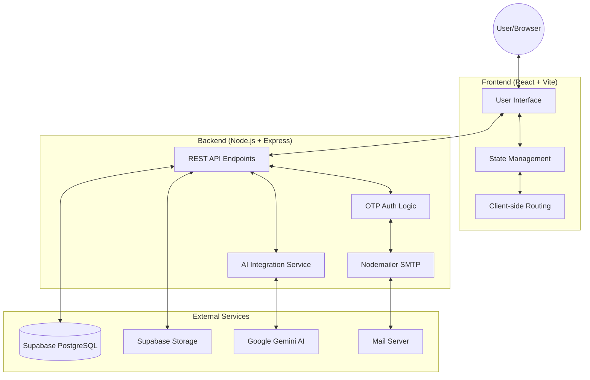

# Codefolio: Student Project Portfolio and Hackathon Manager

Codefolio is a privacy-aware, centralized project registry designed specifically for engineering students to showcase their technical capabilities. It serves as a unified platform for documenting personal projects, team collaborations, and hackathon solutions, helping to reduce duplicated effort and highlight specialization areas within the student community.

---

## Core Objectives

The platform is designed to achieve the following:
- **Centralized Registry**: A single source of truth for all student engineering work.
- **Collaboration Enhancement**: Identify potential teammates based on documented technical strengths.
- **Redundancy Reduction**: Prevent duplicated ideas by making existing solutions discoverable.
- **Strength Identification**: Help mentors and recruiters identify specific student specializations and technical capabilities.

---

## Key Features

### Project Management
- **Personal and Team Projects**: Support for individual work and complex multi-contributor collaborations.
- **Hackathon Solutions**: Dedicated tracking for high-velocity projects and event-specific submissions.
- **Comprehensive Documentation**: Detailed sections for Problem Statements, Solution Architecture, Key Innovations, and Feature Lists.
- **Privacy Controls**: Granular visibility settings including Draft and Published states.

### Contributor Ecosystem
- **Technical Capability Profiles**: Automated generation of contributor profiles showcasing skills, roles, and project history.
- **Specialization Tracking**: Categorization of contributors by field (Web, Mobile, AI, Infrastructure).
- **Network Connectivity**: Direct contact paths via integrated email services for professional networking.

### Intelligent Assistance
- **AI Co-pilot**: An integrated assistance layer (powered by Google Gemini) that provides context-aware information about the project registry.
- **Knowledge Discovery**: Use natural language to find projects using specific technologies or contributors with specific skill sets.

### Security and Authentication
- **Passwordless Authentication**: Secure access via One-Time Password (OTP) verification sent to academic or professional emails.
- **Data Integrity**: Backend validation of all submissions and profile updates.

---

## System Architecture

Codefolio utilizes a decoupled client-server architecture designed for scalability and ease of deployment.



### Component Details
- **Frontend**: A high-performance Single Page Application (SPA) built with React and Vite, utilizing Vanilla CSS for a premium, custom aesthetic.
- **Backend**: An Express.js server providing a RESTful API layer, handling business logic, and orchestrating external service integrations.
- **Database**: Supabase (PostgreSQL) manages the relational data for users, projects, and verification codes.
- **Storage**: Supabase Storage handles project images, gallery assets, and user avatars.
- **AI Engine**: Google Gemini 1.5 Flash provides the reasoning engine for the AI Co-pilot, using project data as context.
- **Communication**: A specialized SMTP integration for delivering secure verification codes.

---

## Technical Specifications

### Tech Stack
- **Core**: React 18, Node.js 20, Express 4.
- **Database**: PostgreSQL (via Supabase).
- **Authentication**: Custom OTP over SMTP.
- **AI**: Google Generative AI SDK.
- **Process Management**: PM2 for production uptime and monitoring.

### Environment Requirements
The following environment variables are required for the system to function:
- `VITE_SUPABASE_URL`: Supabase project endpoint.
- `VITE_SUPABASE_ANON_KEY`: Public API key for database access.
- `GOOGLE_API_KEY`: API key for Gemini AI services.
- `SMTP_HOST` / `SMTP_USER` / `SMTP_PASS`: Mail server credentials for OTP delivery.

---

## Implementation Status Report

Based on the requested features, the current implementation status is as follows:

| Feature | Status | Notes |
| :--- | :--- | :--- |
| Privacy-aware registry | **Implemented** | Supported via visibility flags and authenticated sessions. |
| Personal/Team Projects | **Implemented** | UI supports lead authors and team member attribution. |
| Hackathon Solutions | **Implemented** | Supported via the 'Event' field in project metadata. |
| Technical Capabilities | **Implemented** | Integrated into contributor profiles and skill tags. |
| Feature Documentation | **Implemented** | Project pages include detailed problem/solution/feature fields. |

---

## Deployment Overview

Codefolio is designed to be hosted on local servers or cloud instances using PM2. A detailed deployment guide is available in the `deployment_plan.md` file, covering server hardening, dependency management, and production build processes.

```bash
# Quick Production Launch
npm run build
pm2 start server/index.js --name "codefolio-backend"
```

---

Built with precision by the Codefolio Engineering Team.
